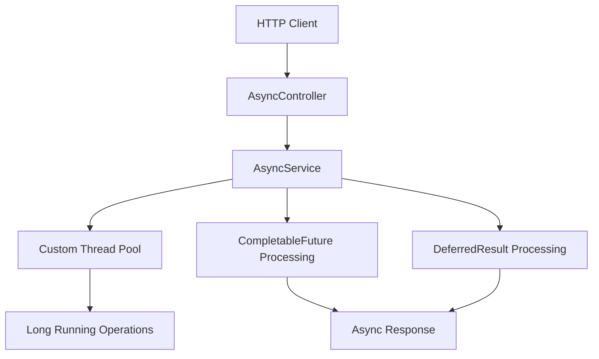

# Design Document

## Overview

The async servlet example feature will demonstrate non-blocking request processing in Spring Boot by implementing multiple asynchronous patterns. This feature will showcase how to handle long-running operations without blocking servlet container threads, improving application scalability and resource utilization.

The implementation will build upon the existing Spring Boot 3.5.0 framework and follow the established project structure patterns, adding new controllers and services that demonstrate different async processing approaches.

## Architecture

### High-Level Architecture



### Async Processing Patterns

1. **CompletableFuture Pattern**: Leverages Java's CompletableFuture for async operations with callback handling
2. **DeferredResult Pattern**: Uses Spring's DeferredResult for more granular control over async responses
3. **Callable Pattern**: Demonstrates Spring's async support with Callable return types

## Components and Interfaces

### 1. AsyncController
- **Location**: `src/main/java/com/example/demo/controller/AsyncController.java`
- **Purpose**: REST endpoints demonstrating different async patterns
- **Key Methods**:
  - `completableFutureExample()` - CompletableFuture-based async processing
  - `deferredResultExample()` - DeferredResult-based async processing
  - `callableExample()` - Callable-based async processing
  - `concurrentRequestsExample()` - Handling multiple concurrent requests

### 2. AsyncService
- **Location**: `src/main/java/com/example/demo/service/AsyncService.java`
- **Purpose**: Business logic for async operations
- **Key Methods**:
  - `performLongRunningTask(String taskId)` - Simulates long-running operations
  - `performAsyncCalculation(int input)` - Async mathematical operations
  - `performAsyncDatabaseOperation()` - Simulated async database calls

### 3. AsyncConfiguration
- **Location**: `src/main/java/com/example/demo/configuration/AsyncConfiguration.java`
- **Purpose**: Configuration for async processing
- **Features**:
  - Custom thread pool configuration
  - Async timeout settings
  - Exception handling configuration

### 4. AsyncTaskDto
- **Location**: `src/main/java/com/example/demo/dto/AsyncTaskDto.java`
- **Purpose**: Data transfer object for async task requests/responses
- **Fields**:
  - `taskId` - Unique identifier for the task
  - `status` - Task status (PENDING, PROCESSING, COMPLETED, FAILED)
  - `result` - Task result data
  - `startTime` - Task start timestamp
  - `completionTime` - Task completion timestamp

### 5. AsyncTaskVo
- **Location**: `src/main/java/com/example/demo/vo/AsyncTaskVo.java`
- **Purpose**: Validation object for async task requests
- **Fields**:
  - `taskName` - Name of the task to execute
  - `delaySeconds` - Simulated processing delay
  - `shouldFail` - Flag to simulate task failure

## Data Models

### AsyncTaskDto Structure
```java
public class AsyncTaskDto {
    private String taskId;
    private TaskStatus status;
    private Object result;
    private LocalDateTime startTime;
    private LocalDateTime completionTime;
    private String errorMessage;
}

public enum TaskStatus {
    PENDING, PROCESSING, COMPLETED, FAILED
}
```

### AsyncTaskVo Structure
```java
public class AsyncTaskVo {
    @NotBlank(message = "Task name is required")
    private String taskName;
    
    @Min(value = 1, message = "Delay must be at least 1 second")
    @Max(value = 30, message = "Delay cannot exceed 30 seconds")
    private Integer delaySeconds;
    
    private Boolean shouldFail = false;
}
```

## Error Handling

### Async Exception Handling Strategy
1. **CompletableFuture Exceptions**: Handle using `exceptionally()` and `handle()` methods
2. **DeferredResult Exceptions**: Set error results using `setErrorResult()`
3. **Global Exception Handler**: Extend existing exception handling to cover async operations
4. **Timeout Handling**: Configure appropriate timeouts for different async operations

### Error Response Format
```java
public class AsyncErrorResponse {
    private String taskId;
    private String errorCode;
    private String errorMessage;
    private LocalDateTime timestamp;
}
```

## Testing Strategy

### Unit Testing
- **AsyncService Tests**: Mock long-running operations and verify async behavior
- **Controller Tests**: Use MockMvc with async result matchers
- **Configuration Tests**: Verify thread pool and timeout configurations

### Integration Testing
- **Concurrent Request Tests**: Verify handling of multiple simultaneous async requests
- **Timeout Tests**: Ensure proper timeout behavior
- **Error Scenario Tests**: Test various failure conditions

### Performance Testing
- **Load Testing**: Verify improved throughput with async processing
- **Resource Usage**: Monitor thread pool utilization
- **Response Time**: Compare sync vs async response times

## Configuration Details

### Thread Pool Configuration
```properties
# Async configuration
spring.task.execution.pool.core-size=5
spring.task.execution.pool.max-size=20
spring.task.execution.pool.queue-capacity=100
spring.task.execution.thread-name-prefix=async-task-
spring.task.execution.pool.keep-alive=60s

# Async timeout settings
spring.mvc.async.request-timeout=30000
```

### Servlet Configuration
- Enable async support in servlet configuration
- Configure appropriate timeout values
- Set up proper error handling for async operations

## API Endpoints Design

### Endpoint Specifications

1. **GET /async/completable-future/{taskName}**
   - Returns: CompletableFuture<AsyncTaskDto>
   - Demonstrates CompletableFuture pattern

2. **POST /async/deferred-result**
   - Body: AsyncTaskVo
   - Returns: DeferredResult<AsyncTaskDto>
   - Demonstrates DeferredResult pattern

3. **GET /async/callable/{delaySeconds}**
   - Returns: Callable<String>
   - Demonstrates Callable pattern

4. **GET /async/concurrent-test**
   - Initiates multiple concurrent async operations
   - Returns: List<AsyncTaskDto>

## Security Considerations

- Input validation for all async task parameters
- Rate limiting for async endpoints to prevent resource exhaustion
- Proper error message sanitization to avoid information leakage
- Thread pool isolation to prevent resource starvation

## Performance Considerations

- Optimal thread pool sizing based on expected load
- Proper timeout configuration to prevent resource leaks
- Monitoring and metrics for async operation performance
- Graceful degradation under high load conditions